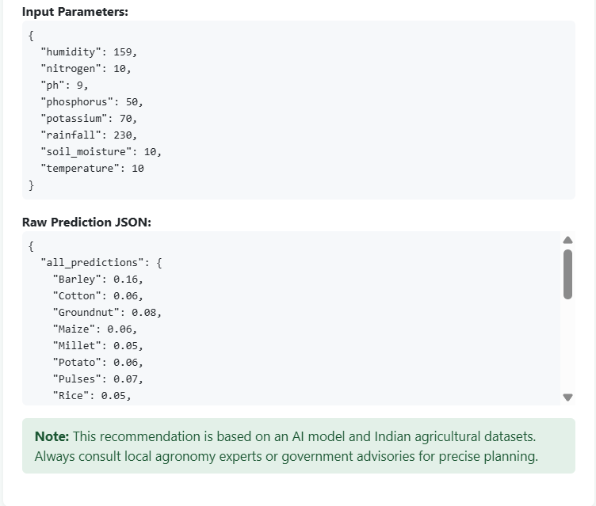

# 🌾 Smart Crop Advisory System: India

**Intelligent, Data-Driven Crop Recommendation Platform for Indian Agriculture**

---

## 🚀 Overview

Smart Crop Advisory System is a full-stack machine learning web application designed to help Indian farmers, agronomists, and agricultural planners select the most suitable crop for their local conditions. By analyzing soil, weather, and nutrient parameters, the tool delivers actionable recommendations and confidence scores, supported by interactive visualizations.

---

## 🛠️ Features

- **Large, realistic Indian crop dataset** for robust ML training
- **Intelligent crop prediction** using Random Forest classifier
- **RESTful Flask API** backend
- **Interactive web frontend** with Bootstrap & Chart.js
- **Visual analytics:** Bar, Pie, and Radar charts for crop recommendations
- **Clear confidence scores** for all major crops
- **Comparison of user input vs. crop requirements**
- **Easy-to-use interface** for rapid insights

---

## ✨ Demo Screenshots

### Crop Recommendation & Confidence


### Visual Analytics: Bar & Pie Charts

- **Bar Chart:** Confidence by Crop
- **Pie Chart:** Confidence Distribution


### Radar Chart: Your Inputs vs. Typical Crop Requirements

- Compares your local conditions against the ideal profile for the recommended crop.


### Prediction Confidence for Major Indian Crops

- See confidence scores for all major crops, not just the top 5.



---

## 📜 Project Abstract

See [smart_india_hackathon_abstract.md](smart_india_hackathon_abstract.md) for a full summary and vision.

---

## 🚀 Future Scope

Want to know what’s planned next? Check out [future_work.md](future_work.md) for our roadmap and upcoming features.

---

## 🔬 Technical Stack

For full details, see [tech_stack.md](tech_stack.md).

---

## 📂 File Structure

```
├── app.py                # Flask API backend
├── train.py              # ML model training script
├── large_indian_crop_data.csv # Large realistic crop dataset
├── templates/
│   └── predict.html      # Web UI
├── static/
│   └── ...               # CSS, JS, Chart.js
├── README.md             # Project documentation
├── smart_india_hackathon_abstract.md   # Project abstract
├── future_work.md        # Planned features & roadmap
├── tech_stack.md         # Full technical stack details
└── references.md         # Citations and data sources
```

---

## 💡 Usage

1. **Train the model:**  
   ```bash
   python train.py
   ```
2. **Run the backend:**  
   ```bash
   python app.py
   ```
3. **Access the frontend:**  
   Open `predict.html` in your browser.

---

## 📈 Results

- **Diverse recommendations:** Model adapts to changing soil and weather.
- **Clear rationale:** Confidence scores and charts show *why* a crop was chosen.
- **User input vs. crop needs:** Radar chart visualizes alignment and gaps.

---

## 📑 References

See [references.md](references.md) for datasets, API docs, and research papers.

---

## 👔 Perfect for Resume & High-Paying Job Interviews

This project showcases:
- Real-world ML application
- Full-stack development
- Data engineering
- Visualization
- Communication of decisions and results
- Domain knowledge in agri-tech

---

## 🗣️ Contact

For questions, collaborations, or feedback, open an issue or connect via GitHub!

---

## 📜 License

This project is licensed under the MIT License - see the [LICENSE](LICENSE) file for details.
